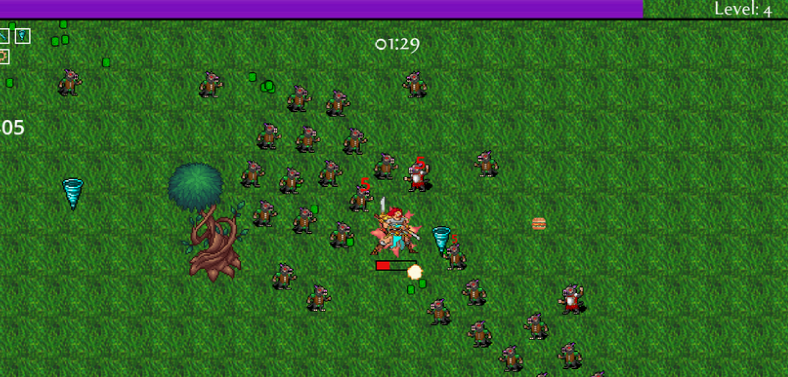
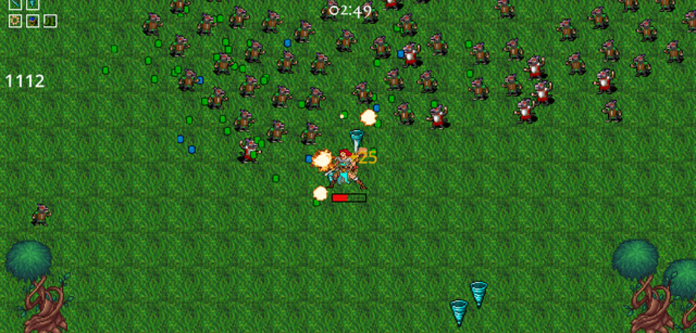

<h1>Vampire Survivors-like Game</h1>

<h3><strong>Vampire Survivors-like Game</strong> is a fast-paced action survival game built with Godot and GDScript. Players must survive waves of enemies, level up, unlock new abilities, and gather items to stay alive. The game features a dynamic gameplay loop with a character screen, level choice, enemy spawning, leveling-up mechanics, and a game over screen. This game draws inspiration from the popular Vampire Survivors title.</h3>

<h3>Technologies Used</h3>
<ul>
  <li><strong>Godot</strong> – An open-source game engine used to create the game, featuring flexible 2D and 3D capabilities.</li>
  <li><strong>GDScript</strong> – A scripting language used for gameplay logic, event handling, and game mechanics in Godot.</li>
  <li><strong>Scenes</strong> – Godot's scene system is used for organizing the game world, including menus, gameplay, and game over screens.</li>
  <li><strong>Leveling and Item System</strong> – The game features a dynamic leveling system where players can choose new abilities and items as they progress.</li>
  <li><strong>Enemy Spawning</strong> – Enemies are spawned in waves, and the difficulty increases as players level up.</li>
  <li><strong>Game Over Mechanics</strong> – A game over screen is displayed when the player’s character is defeated by enemies.</li>
</ul>

<h3>Features</h3>
<ul>
  <li><strong>Character Screen</strong>: The player can customize and view their character’s stats before starting the game.</li>
  <li><strong>Level Selection</strong>: Players can choose a level to start the game, each with varying difficulty and enemy types.</li>
  <li><strong>Enemy Spawning</strong>: Enemies spawn in waves, increasing in strength and number as the player progresses.</li>
  <li><strong>Leveling Up</strong>: As players defeat enemies, they earn experience points and level up, unlocking new abilities and upgrades.</li>
  <li><strong>Item Drops</strong>: Enemies drop items that provide benefits such as healing, damage boosts, or special abilities.</li>
  <li><strong>Game Over Screen</strong>: A game over screen is triggered when the player’s character is defeated, offering options to restart or quit.</li>
</ul>

<h3>Screenshots</h3>

<table>
  <tr>
    <td>
      
    </td>
    <td>
      <b>Gameplay Screenshot 1:</b>
      

        A gameplay screenshot showcasing the player’s character in action, surrounded by enemies. This demonstrates the core mechanics of survival and combat in the game.
      

    </td>
  </tr>
  <tr>
    <td>
      
    </td>
    <td>
      <b>Gameplay Screenshot 2:</b>
      

        A second gameplay screenshot illustrating the intensity of enemy waves and the progression of the player’s character. It highlights the leveling-up mechanics and item drops during combat.
      

    </td>
  </tr>
</table>

<h3>How It Works</h3>

<h4>1. Character Screen</h4>

The character screen is displayed before the game starts. Players can view their stats, abilities, and choose a starting level. This screen sets up the player’s starting position and allows for customizations.

<h4>2. Level Selection</h4>

Players can choose a level to start the game, with each level offering a unique challenge and varying enemies. The difficulty increases as the player progresses through each wave of enemies.

<h4>3. Enemy Spawning</h4>

Enemies spawn in waves, and the difficulty of the waves increases over time. As the player levels up, stronger enemies begin to appear, adding to the challenge.

<h4>4. Leveling Up</h4>

As players defeat enemies, they gain experience points and level up. Upon leveling up, players can choose new abilities or items that help them survive longer against the increasing difficulty.

<h4>5. Item Drops</h4>

Enemies drop items when defeated. These items provide various boosts such as health regeneration, damage increases, or special abilities that help the player during the game.

<h4>6. Game Over Screen</h4>

If the player’s character is defeated by enemies, the game over screen appears. Players are given the option to restart or quit the game. The game tracks progress and rewards players for surviving longer.

<h3>Installation</h3>
<ul>
  <li>Clone the repository: <code>git clone https://github.com/Juntakk/survivors.git</code></li>
  <li>Navigate to the project folder: <code>cd survivorsclone</code></li>
  <li>Open the project in Godot Engine.</li>
  <li>Run the game by clicking the play button in Godot's interface.</li>
  <li>Enjoy the game!</li>
</ul>
